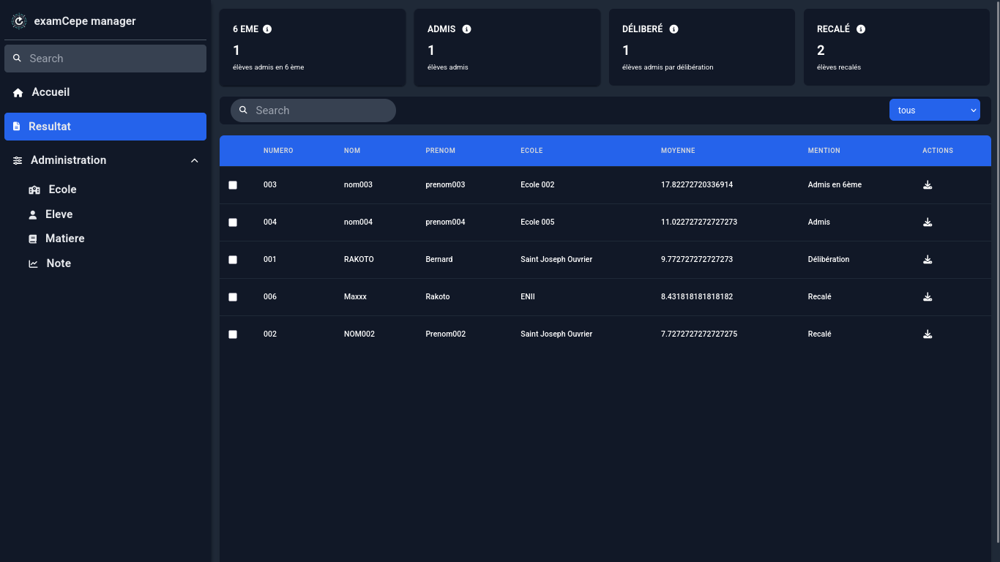
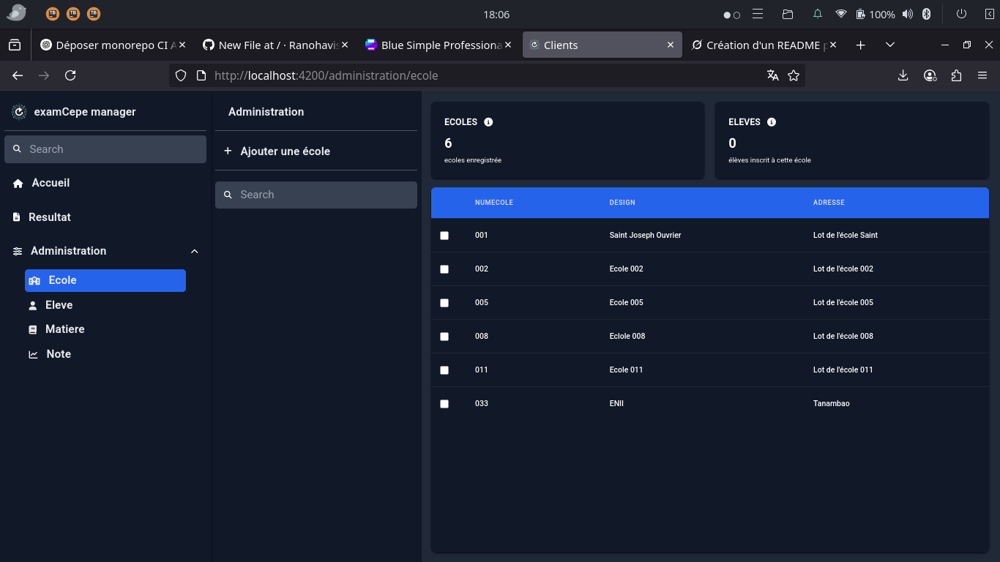
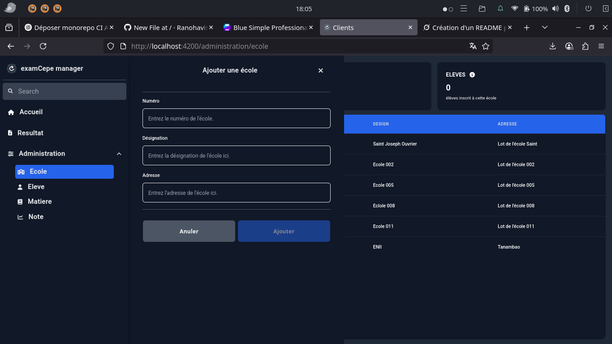

# 🎓 ExamCepe Manager

**ExamCepe Manager** est une application web construite avec **Angular** pour le front-end et **CodeIgniter** pour le back-end. Elle permet de gérer les données des écoles et des élèves, notamment l’ajout, la modification, et la visualisation des résultats scolaires.

---

## 🚀 Fonctionnalités

- Ajouter et gérer les informations des écoles (numéro, désignation, adresse).
- Consulter et éditer les listes d’écoles et d’élèves.
- Afficher les résultats avec le statut d’admission :
  - ✅ Admis
  - ⚖️ Délibéré
  - ❌ Recalé
- Interface utilisateur conviviale avec recherche intégrée.

---

## 📸 Captures d’écran

<p align="center">
  <br>
  <br>
  
</p>

---

## 🛠️ Prérequis

- [Node.js](https://nodejs.org/) et `npm` (pour Angular)
- [PHP](https://www.php.net/)
- [Composer](https://getcomposer.org/) (pour les dépendances PHP)
- Serveur web local (Apache ou Nginx recommandé)

---

## ⚙️ Installation

### 🔧 Back-end (CodeIgniter)

```bash
cd backend/
composer install
